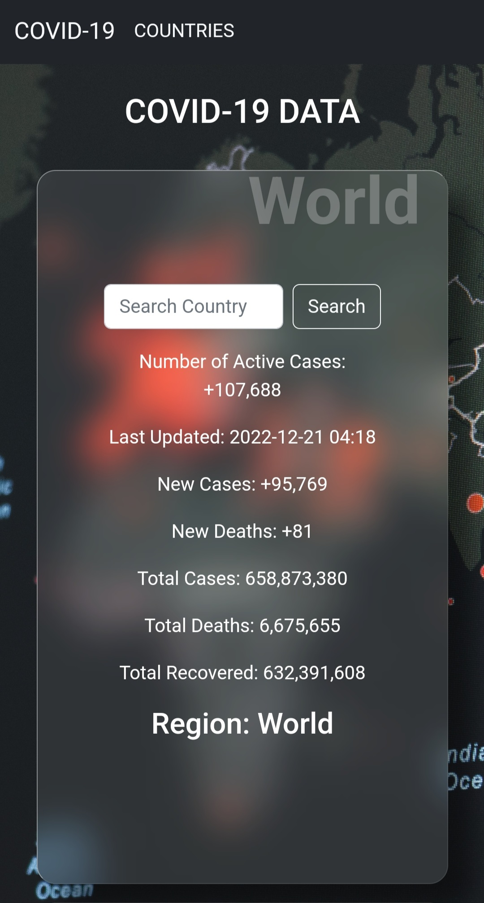

# Project Covid-19 Statistics

# Description

This project entailed getting Covid-19 statistical data from an API [COVID-19 API](https://covid-19.dataflowkit.com/v1) in real time. The project contains a search feature to be able to search one's country of interest and gain data in regards to Covid-19. 

The data gotten from the API include:
- Number of Active Cases
- The Country
- The last time the information was updated
- New Cases
- New Deaths
- Total Cases
- Total Deaths
- Total Recovered

# Getting Started

In order for you to use the content on this repo ensure you have the following:

- A computer that runs on either of the following; (Windows 7+, Linux, Mac OS)

- Some bit of patience for your own sanity.

# Installation

To be able to use this repository on your machine one need to:

- Open a terminal on your computer

- Clone the repo by using the following :

        git@github.com:MathaiMarvin/Project-Covid.git

- Change directory to the repository folder using:

        cd

- Open in code editor: Visual Studio Code:

        code .

# Running the Application

## Live link of the web page

- A link to the site:

        https://mathaimarvin.github.io/Project-Covid/

# Authors
This project was worked on by:

- Marvin Mathai

# License
The project is licensed under Apache 2.0.